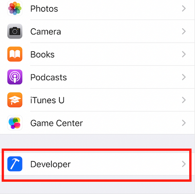
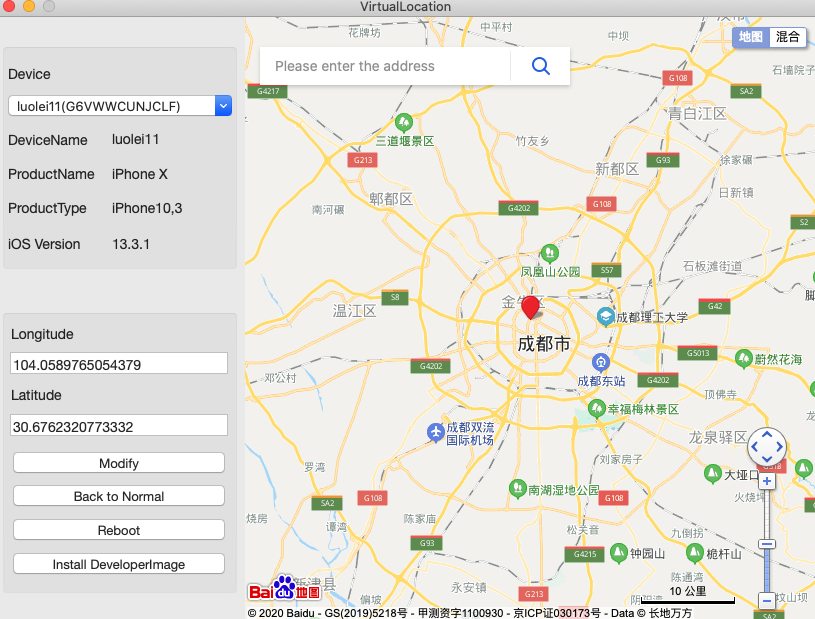

# VirualLocation
It can modify the system positioning of iOS devices and simulate any virtual location

#Using
Before using it, your iOS device needs to have the corresponding version of DeveloperImage installed and You can find the DeveloperImage file under '/Applications/Xcode.app/Contents/Developer/Platforms/iPhoneOS.platform/DeviceSupport'

If you have installed it, you can see the following

- 

The software UI is as follows

- 

